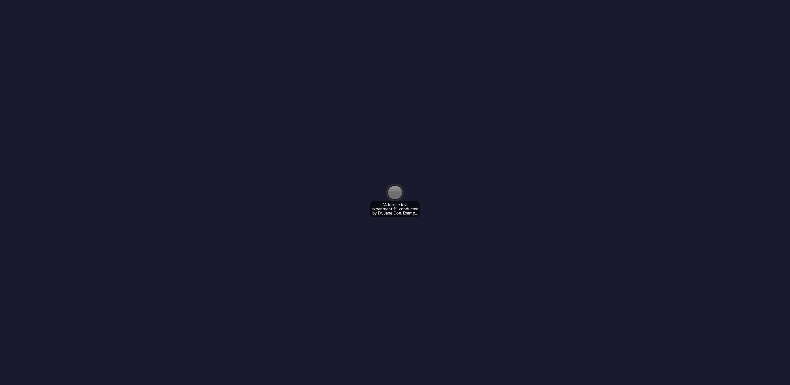

# Knowledge Graph Animation Demo

An interactive visualization demonstrating how a knowledge graph is built incrementally from natural language experiment descriptions. The animation shows entity extraction, classification, and graph merging in real-time.

## Live Demos

| Implementation | Interactive Demo | Description |
|----------------|------------------|-------------|
| 3D Force Graph | [View Demo](kg-3d.html) | WebGL-based 3D visualization with 2D/3D toggle |
| D3.js | [View Demo](kg-d3.html) | SVG-based 2D force-directed graph |
| Vis.js | [View Demo](kg-visjs.html) | Canvas-based network visualization |
| Cytoscape.js | [View Demo](kg-cytoscape.html) | Graph theory library |
| Graphviz | [View Demo](kg-graphviz.html) | DOT language renderer |

## Animation Preview

The animation demonstrates knowledge graph construction through three experiment entries:

1. **Chapter 1**: *"A tensile test experiment #1 conducted by Dr. Jane Doe, Example Lab Corp."*
2. **Chapter 2**: *"A tensile test experiment #2 conducted by Dr. John Doe, Example Lab Corp."*
3. **Chapter 3**: *"A tensile test experiment #3 conducted by Dr. John Doe, Manager of Example Lab Corp."*

### D3.js

### Vis.js

### Cytoscape.js

### Graphviz

### 3D Force Graph

## Node Types

| Color | Type | Description |
|-------|------|-------------|
| Gray (#999) | Input | User text shown in quotes |
| Green (#69b3a2) | Instance | Extracted entity |
| Pink (#ff9999) | Class | Type classification |

## Node States (Border Colors)

| Border Color | State | Description |
|--------------|-------|-------------|
| Red (#ff0000) | New | Newly created, not yet stored |
| Yellow (#ffcc00) | Modified | Existing node with updated data |
| Dark (#333) | Stored | Persisted in the knowledge graph |

## Features

- **Animation Controls**: Play/restart animation, adjust speed
- **GIF Export**: Record and download animation as GIF
- **2D/3D Toggle** (3D Force Graph only): Switch between 2D and 3D rendering modes
- **Interactive**: Drag nodes, zoom, and pan the graph

